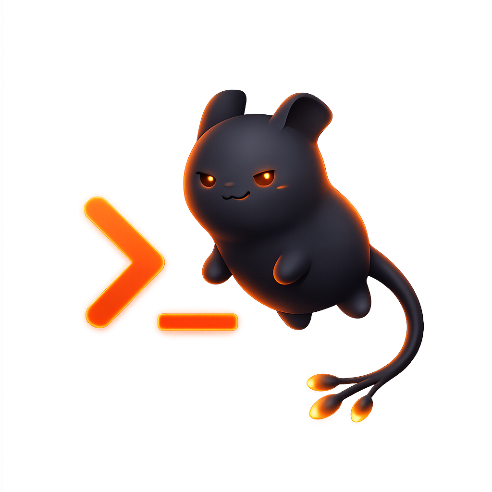

  

<h1 align="center">Quorp</h1>

  <strong>A high-performance, TUI-first text editor and agentic interface.</strong>

  

  Native Rust foundations, terminal-native workflows, and a mascot with just enough menace.

Quorp takes the robust GPUI research foundation behind Zed and reworks it into a focused terminal-first environment for editing, orchestration, and AI-assisted workflows. The goal is a fast, capable interface that feels at home in the shell while still supporting rich rendering and modern agent-driven tooling.

## Status

Quorp is in its early structural transition from the Zed backend into a standalone TUI-first project. The current work is centered on carving away GUI assumptions, preserving strong native performance characteristics, and shaping the core terminal experience.

## License

Quorp is open-source software licensed under the MIT License.
