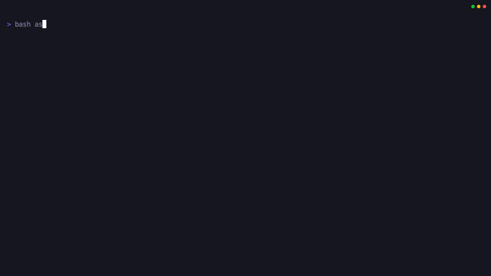

<p align="center">
  
</p>

# Quorp

Quorp is a standalone, terminal-first coding agent for real repositories. It combines an interactive TUI, autonomous task execution, repo scanning, indexed code intelligence, guarded file edits, benchmark runs, proof receipts, and replayable execution logs in one Rust CLI.

The default model path is NVIDIA NIM with `qwen/qwen3-coder-480b-a35b-instruct`, exposed through an OpenAI-compatible API surface and Quorp's native tool-call loop.

## Live Demos

<p>
  
</p>

<p>
  
</p>

The recordings are generated with VHS tapes in `assets/recordings/`.

## Quick Start

Install Rust, then build Quorp from the repository:

```sh
rustup update stable
cargo build -p quorp
```

Configure a provider key:

```sh
mkdir -p ~/.quorp
printf 'NVIDIA_API_KEY=nvapi-...\n' >> ~/.quorp/.env
```

Check the local environment:

```sh
cargo run -p quorp -- doctor
```

Start the interactive TUI from a repository:

```sh
cargo run -p quorp --
```

For a shell-installed binary:

```sh
cargo install --path crates/quorp --locked
quorp doctor
quorp
```

## Provider Setup

Quorp defaults to:

- Provider: `nvidia`
- Base URL: `https://integrate.api.nvidia.com/v1`
- Model: `qwen/qwen3-coder-480b-a35b-instruct`

Supported environment variables:

- `NVIDIA_API_KEY`, `QUORP_NVIDIA_API_KEY`, or `QUORP_API_KEY`: provider authentication.
- `QUORP_PROVIDER`: provider selector.
- `QUORP_MODEL`: model override. NVIDIA runs accept the default Qwen model and `ssd_moe/...` models.
- `QUORP_NVIDIA_BASE_URL`: override the NVIDIA-compatible base URL.

Quorp loads provider env files from workspace `.quorp/.env` files and `~/.quorp/.env`. Keep keys out of git.

## CLI Modes

- `quorp`: launch the interactive terminal session UI.
- `quorp exec "<task>"`: run a bounded one-shot task.
- `quorp run --condition <name>`: run an autonomous objective with retry and result-directory controls.
- `quorp run resume`: resume a previous autonomous run.
- `quorp benchmark run --path <challenge>`: execute one benchmark case in `host` or `tmp-copy` mode.
- `quorp benchmark batch --cases-root <dir>`: run a benchmark suite.
- `quorp benchmark score --run-dir <dir>`: generate scoreboards and regression summaries.
- `quorp replay <run-dir>`: summarize a recorded run ledger.
- `quorp proof show|export|verify`: inspect and verify proof receipts.
- `quorp diagnostics`: collect diagnostic context.
- `quorp doctor`: verify workspace, trust, provider, sandbox, permissions, MCP, proof, context, and hooks.
- `quorp scan --symbols`: scan a workspace and count top-level Rust symbols.
- `quorp index build|status|explain`: build or inspect the local code index.
- `quorp commands`: print the slash command registry.
- `quorp permissions --tool <tool>`: preview tool-policy decisions.

Useful benchmark example:

```sh
quorp benchmark run \
  --path benchmark/challenges/rust-swebench-top5/04-cargo-dist-create-release \
  --result-dir .quorp/readme-captures/benchmark-cargo-dist \
  --sandbox tmp-copy
```

## Common Capabilities

| Area | What Quorp does |
| --- | --- |
| Interactive agent UI | Terminal chat, session status, slash commands, command palette behavior, model/provider switching, and permission prompts. |
| Repository context | Workspace scanning, indexing, symbol harvesting, text search, file search, definitions, references, hover, rename preview, code actions, and LSP/Cargo diagnostics. |
| File work | Read, edit, write, preview, and apply patch workflows with validation hooks. |
| Shell work | Execute commands, run validation lanes, capture failures, and surface useful diagnostics back into the agent loop. |
| Version control | Git checkpoints, rollback, working-tree diffs, proof lanes, replay summaries, and diagnostics bundles. |
| Benchmarking | Single-case runs, batch suites, scoring, reports, deterministic evaluation, and benchmark proof receipts. |

## Advanced Capabilities

| Capability | Why it matters |
| --- | --- |
| Native tool calls | OpenAI-compatible model calls through NVIDIA NIM drive structured read, edit, shell, diagnostics, MCP, and browser/process tools. |
| Patch VM receipts | Hash-checked preview/apply edits and write receipts make file changes auditable before and after application. |
| Run ledger | Hash-chained event logs capture model requests, tool calls, status updates, compaction packets, validation, and final state. |
| Proof receipts | Benchmark and autonomous runs can export proof artifacts with validation commands, changed files, hashes, provider/model metadata, and residual risks. |
| Prompt compaction | Runtime policies compact long sessions into state packets while preserving tool evidence and current task state. |
| Memory and rules | Memory recall, rule proposals, rule forge flows, and failed-edit memory keep repeated context available without bloating every prompt. |
| MCP integration | MCP tools, resources, and prompts can be merged into the agent runtime under trust-aware settings. |
| Managed tools | Process control and browser automation tools are available behind explicit policy gates. |
| Trust-aware config | User and workspace settings merge with trust gates, sandbox downgrades, permission downgrades, and managed remote guardrails. |

## Safety Model

Quorp separates the model's plan from the system's authority to act.

- Sandbox modes: `host` for direct workspace execution and `tmp-copy` for isolated challenge or autonomous runs.
- Permission modes: `read-only`, `ask`, `accept-edits`, `auto-safe`, and `yolo-sandbox`.
- Trust gates: untrusted workspaces default to conservative settings.
- Tool policy: command, write, network, MCP, browser, and process access are checked before execution.
- Temporary copies: benchmark and autonomous runs can materialize a separate workspace and keep the original tree untouched.
- Managed remote guardrails: remote/provider execution is paired with full-auto sandboxing and network/process policy checks.

Preview a decision before changing policy:

```sh
quorp permissions \
  --mode auto-safe \
  --tool run_command \
  --command 'cargo test' \
  --allow-command 'cargo *'
```

## Proof And Observability

Quorp records the work needed to understand, replay, or audit a run:

- Run ledgers: hash-chained JSONL event streams.
- Proof receipts: validation commands, changed files, artifact hashes, provider/model metadata, and residual risks.
- Diagnostics bundles: workspace, provider, sandbox, permissions, context index, hooks, MCP, and proof-lane status.
- Replay summaries: event counts and run metadata from a recorded run directory.
- Benchmark reports: per-case Markdown/JSON reports plus scoreboards for suites and regressions.

## Configuration

User configuration lives in:

```text
~/.quorp/settings.json
```

Workspace configuration lives in:

```text
<workspace>/.quorp/settings.json
```

Configuration covers provider selection, model and base URL overrides, MCP settings, tool policy, proof lanes, memory/rules toggles, hooks, and workspace trust. Workspace settings are merged through the trust model so a repository cannot silently escalate unsafe behavior.

## Development

Build and inspect the CLI:

```sh
cargo build -p quorp
cargo run -p quorp -- --help
```

Use the repository clippy wrapper for linting:

```sh
./script/clippy
```

Regenerate README recordings:

```sh
vhs assets/recordings/readme-feature-tour.tape
vhs assets/recordings/readme-benchmark.tape
```

The benchmark recording uses a captured provider-backed trace from the cargo-dist create-release challenge. Do not commit API keys, local `.quorp/readme-captures` outputs, or transient benchmark sandboxes.

## License

Quorp is open-source software licensed under the GNU General Public License v3.0 or later.
